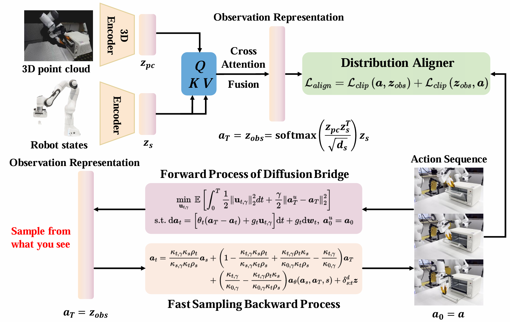

<h1 align="center"> [ICML 2026] Sample from What You See: Visuomotor Policy Learning via Diffusion Bridge with Observation-Embedded Stochastic Differential Equation</h1>

<div align="center">
  Zhaoyang Liu<sup>1,2</sup>, Mokai Pan<sup>1</sup>, Zhongyi Wang<sup>1</sup>, Kaizhen Zhu<sup>1</sup>, Haotao Lu<sup>1</sup>, 
  
  Haipeng Zhang<sup>1</sup>, Jingya Wang<sup>1</sup>, Ye Shi<sup>1,2,†</sup>

  <sup>1</sup>ShanghaiTech University <sup>2</sup>InstAdapt
</div>

<h3 align="center"> [<a href="https://arxiv.org/pdf/2512.07212">arXiv</a>] </h3> <!-- [<a href="https://unidb-soc.github.io/UniDB_page/">Project page</a>] -->

<div align="center">
    
</div>

<div align="center">
    
</div>


# Installing BridgePolicy

This guide matches the current BridgePolicy codebase and folder structure.

The setup below is a practical reference for Linux machines with NVIDIA GPUs. Please make sure your PyTorch build matches your local CUDA version.

If you have already cloned the repository, just `cd` into it. Otherwise:

```bash
git clone <your-bridgepolicy-repo-url>
cd bridge_policy
```

**Please follow the steps in order. In particular, keep the Gym version consistent with the local copy in `third_party/gym-0.21.0`.**

---

1. Create a Python environment

```bash
conda remove -n bridgepolicy --all
conda create -n bridgepolicy python=3.8
conda activate bridgepolicy
```

---

2. Install PyTorch

```bash
# Example: CUDA 12.1
pip3 install torch torchvision torchaudio --index-url https://download.pytorch.org/whl/cu121

# Otherwise, install the torch version that matches your CUDA runtime.
```

---

3. Install BridgePolicy

```bash
cd BridgePolicy
pip install -e .
cd ..
```

This installs the main package:

```bash
bridge_policy_3d
```

---

4. Install MuJoCo in `~/.mujoco`

```bash
cd ~/.mujoco
wget https://github.com/deepmind/mujoco/releases/download/2.1.0/mujoco210-linux-x86_64.tar.gz -O mujoco210.tar.gz --no-check-certificate
tar -xvzf mujoco210.tar.gz
```

Add the following to your shell config (for example `~/.bashrc`), then `source ~/.bashrc` and open a new terminal:

```bash
export LD_LIBRARY_PATH=$LD_LIBRARY_PATH:${HOME}/.mujoco/mujoco210/bin
export LD_LIBRARY_PATH=$LD_LIBRARY_PATH:/usr/lib/nvidia
export LD_LIBRARY_PATH=$LD_LIBRARY_PATH:/usr/local/cuda/lib64
export MUJOCO_GL=egl
```

Then install `mujoco-py` from `third_party`:

```bash
cd third_party/mujoco-py-2.1.2.14
pip install -e .
cd ../..
```

---

5. Install simulation environments

```bash
pip install setuptools==59.5.0 Cython==0.29.35 patchelf==0.17.2.0

cd third_party
cd dexart-release && pip install -e . && cd ..
cd gym-0.21.0 && pip install -e . && cd ..
cd Metaworld && pip install -e . && cd ..
cd rrl-dependencies && pip install -e mj_envs/. && pip install -e mjrl/. && cd ..
cd ..
```

Optional assets:

- If you plan to run DexArt tasks, download the DexArt assets and place them under `third_party/dexart-release/assets`.
- If you plan to run Adroit experiments that depend on expert checkpoints, place the required checkpoints under the corresponding local third-party folder before training.

---

6. Install simplified PyTorch3D

```bash
cd third_party/pytorch3d_simplified
pip install -e .
cd ../..
```

---

7. Install additional Python packages

```bash
pip install zarr==2.12.0 wandb ipdb gpustat dm_control omegaconf hydra-core==1.2.0 dill==0.3.5.1 einops==0.4.1 diffusers==0.11.1 numba==0.56.4 moviepy imageio av matplotlib termcolor
```

If you use the UniDB-related components, also install:

```bash
pip install torchsummaryX lmdb lpips numpy opencv-python Pillow PyYAML scipy tensorboardX timm tqdm gradio tensorboard ema_pytorch IPython pytorch_fid
```

Note: the codebase imports `einops`, so use the `einops` package name rather than `einop`.

---

8. Install the point cloud visualizer (optional)

```bash
pip install kaleido plotly
cd visualizer
pip install -e .
cd ..
```

---

9. Before training

BridgePolicy task configs intentionally leave dataset paths blank for open-source release. Before launching training, set the dataset path in one of the following ways:

- Edit the relevant file under `BridgePolicy/bridge_policy_3d/config/task/` and fill in `zarr_path`
- Or override it from the command line with Hydra

Example:

```bash
cd BridgePolicy
python train.py --config-name=<your_config>.yaml task.dataset.zarr_path=/path/to/your_dataset.zarr
```

Training scripts in `scripts/` write outputs under `data/outputs` by default. You can override the root output directory with:

```bash
export BRIDGE_POLICY_RUN_ROOT=/path/to/your/output_root
```

After that, you can use the provided shell scripts in `scripts/` or launch training directly with Hydra.

# Citation
If you find this repository useful in your research, please consider citing our paper:
```
@article{liu2025sample,
  title={Sample from What You See: Visuomotor Policy Learning via Diffusion Bridge with Observation-Embedded Stochastic Differential Equation},
  author={Liu, Zhaoyang and Pan, Mokai and Wang, Zhongyi and Zhu, Kaizhen and Lu, Haotao and Zhang, Haipeng and Wang, Jingya and Shi, Ye},
  journal={arXiv preprint arXiv:2512.07212},
  year={2025}
}
```